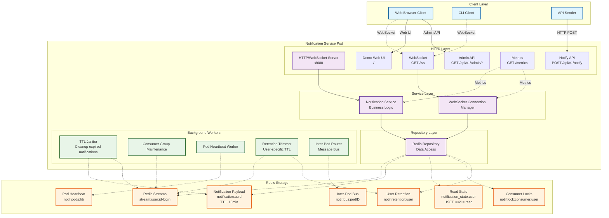
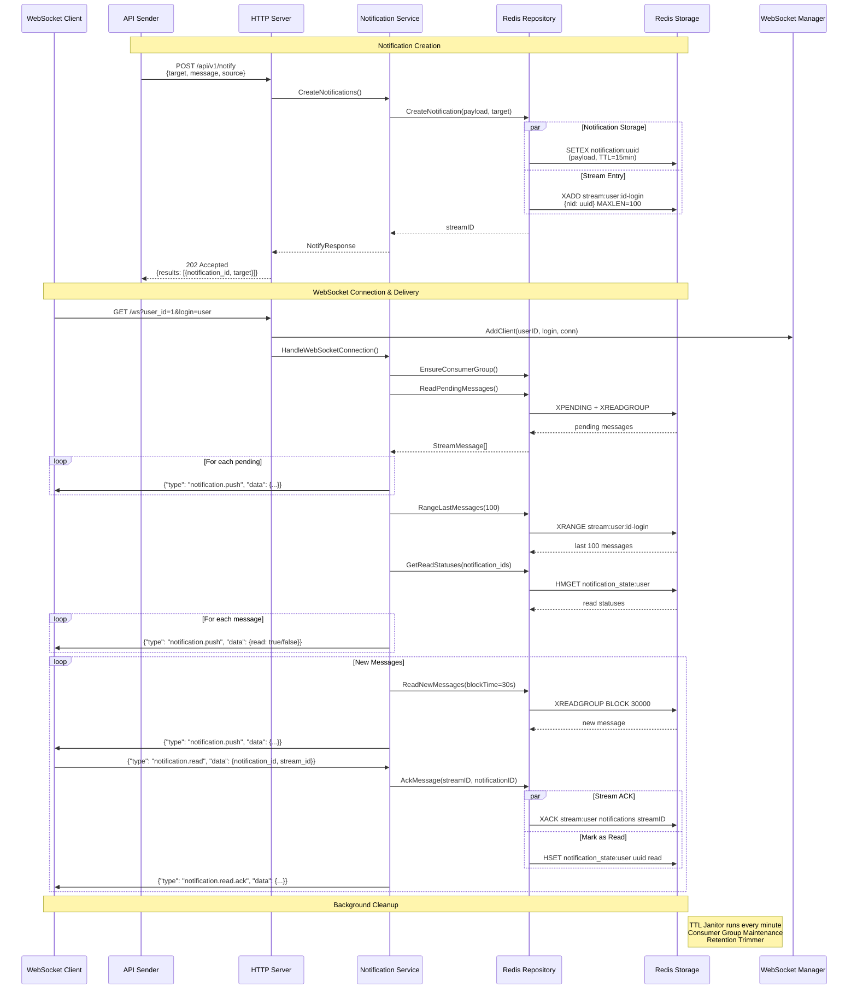
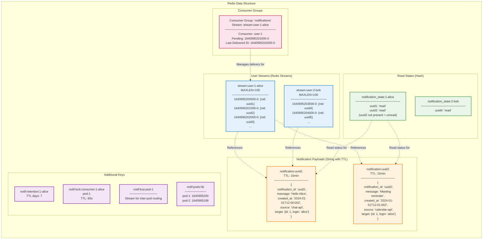

# Notification Service MVP

A high-performance real-time notification service built with Go and Redis Streams, featuring WebSocket delivery, TTL management, acknowledgments, and cluster support.

## Overview

This MVP notification service provides:
- Real-time notification delivery via WebSocket
- Redis Streams for scalable message queuing
- 15-minute TTL for notification payloads
- Message acknowledgment and read status tracking
- Consumer groups for reliable delivery
- Multi-pod cluster support with distributed locking
- Background workers for cleanup and maintenance
- Admin API and Web UI for monitoring
- Prometheus metrics integration

## Architecture

### System Components



### Notification Lifecycle



### Cluster Architecture

```mermaid
graph TB
    subgraph "Multi-Pod Cluster Architecture"
        
        subgraph "Pod 1"
            direction TB
            P1[Pod ID: pod-1]
            P1HTTP[HTTP Server :8080]
            P1WS[WebSocket Manager]
            P1Service[Notification Service]
            P1Workers[Background Workers]
        end
        
        subgraph "Pod 2" 
            direction TB
            P2[Pod ID: pod-2]
            P2HTTP[HTTP Server :8080]
            P2WS[WebSocket Manager]
            P2Service[Notification Service]
            P2Workers[Background Workers]
        end
        
        subgraph "Pod N"
            direction TB
            PN[Pod ID: pod-n]
            PNHTTP[HTTP Server :8080]
            PNWS[WebSocket Manager]
            PNService[Notification Service]
            PNWorkers[Background Workers]
        end
    end

    subgraph "Load Balancer"
        LB[Load Balancer<br/>HTTP/WebSocket]
    end

    subgraph "Shared Redis Cluster"
        direction TB
        
        subgraph "User Streams"
            UserStreams[stream:user:1-alice<br/>stream:user:2-bob<br/>stream:user:3-charlie]
        end
        
        subgraph "Notification Payloads"
            Payloads[notification:uuid1<br/>notification:uuid2<br/>notification:uuid3<br/>TTL: 15min]
        end
        
        subgraph "Consumer Locks"
            Locks[notif:lock:consumer:1-alice → pod-1<br/>notif:lock:consumer:2-bob → pod-2<br/>notif:lock:consumer:3-charlie → pod-1]
        end
        
        subgraph "Inter-Pod Bus"
            Bus[notif:bus:pod-1<br/>notif:bus:pod-2<br/>notif:bus:pod-n]
        end
        
        subgraph "Pod Heartbeats"
            Heartbeats[notif:pods:hb<br/>pod-1: timestamp<br/>pod-2: timestamp<br/>pod-n: timestamp]
        end
    end

    subgraph "Clients"
        C1[Client 1<br/>user:1-alice]
        C2[Client 2<br/>user:2-bob]  
        C3[Client 3<br/>user:3-charlie]
    end

    %% Client connections through load balancer
    C1 -.->|WebSocket| LB
    C2 -.->|WebSocket| LB
    C3 -.->|WebSocket| LB

    %% Load balancer to pods
    LB -.-> P1HTTP
    LB -.-> P2HTTP  
    LB -.-> PNHTTP

    %% Pod connections to Redis
    P1Service -.-> UserStreams
    P1Service -.-> Payloads
    P1Service -.-> Locks
    P2Service -.-> UserStreams
    P2Service -.-> Payloads
    P2Service -.-> Locks
    PNService -.-> UserStreams
    PNService -.-> Payloads
    PNService -.-> Locks

    %% Inter-pod communication
    P1Workers -.-> Bus
    P2Workers -.-> Bus
    PNWorkers -.-> Bus

    %% Heartbeat monitoring
    P1Workers -.-> Heartbeats
    P2Workers -.-> Heartbeats
    PNWorkers -.-> Heartbeats

    %% Annotations
    Note1[Consumer Lock ensures<br/>only one pod reads<br/>messages for each user]
    Note2[Inter-pod bus routes<br/>messages to correct<br/>pod for local delivery]
    Note3[Heartbeat system<br/>detects failed pods<br/>and releases locks]

    classDef podNode fill:#e3f2fd,stroke:#0277bd,stroke-width:2px
    classDef redisNode fill:#fff3e0,stroke:#e65100,stroke-width:2px  
    classDef clientNode fill:#e8f5e8,stroke:#2e7d32,stroke-width:2px
    classDef lbNode fill:#fce4ec,stroke:#c2185b,stroke-width:2px
    classDef noteNode fill:#f5f5f5,stroke:#757575,stroke-width:1px,stroke-dasharray: 5 5

    class P1,P1HTTP,P1WS,P1Service,P1Workers,P2,P2HTTP,P2WS,P2Service,P2Workers,PN,PNHTTP,PNWS,PNService,PNWorkers podNode
    class UserStreams,Payloads,Locks,Bus,Heartbeats redisNode
    class C1,C2,C3 clientNode
    class LB lbNode
    class Note1,Note2,Note3 noteNode
```



## Data Models and Redis Schema

### Core Data Structures

#### NotifyRequest
```json
{
  "target": [
    {"id": 1, "login": "alice"},
    {"id": 2, "login": "bob"}
  ],
  "message": "Your order has been shipped",
  "created_at": "2024-01-01T12:00:00Z",
  "source": "order-service"
}
```

#### NotificationPayload (stored in Redis)
```json
{
  "notification_id": "550e8400-e29b-41d4-a716-446655440000",
  "message": "Your order has been shipped",
  "created_at": "2024-01-01T12:00:00Z",
  "source": "order-service",
  "target": {"id": 1, "login": "alice"}
}
```

#### PushMessage (sent to WebSocket clients)
```json
{
  "type": "notification.push",
  "data": {
    "notification_id": "550e8400-e29b-41d4-a716-446655440000",
    "stream_id": "1640995200000-0",
    "message": "Your order has been shipped",
    "created_at": "2024-01-01T12:00:00Z",
    "source": "order-service",
    "status": "unread",
    "read": false
  }
}
```

#### ReadEvent (ACK from client)
```json
{
  "type": "notification.read",
  "data": {
    "notification_id": "550e8400-e29b-41d4-a716-446655440000",
    "stream_id": "1640995200000-0"
  }
}
```

### Redis Schema



### Redis Key Patterns

| Key Pattern                        | Type   | Purpose                                  | TTL   |
| ---------------------------------- | ------ | ---------------------------------------- | ----- |
| `stream:user:{id}-{login}`         | Stream | Per-user notification queue (MAXLEN=100) | -     |
| `notification:{uuid}`              | String | Notification payload JSON                | 15min |
| `notification_state:{id}-{login}`  | Hash   | Read status tracking (`{uuid}: "read"`)  | -     |
| `notif:lock:consumer:{id}-{login}` | String | Consumer lock for distributed processing | 60s   |
| `notif:retention:{id}-{login}`     | String | Per-user retention days (1-15)           | -     |
| `notif:bus:{pod_id}`               | Stream | Inter-pod message routing                | -     |
| `notif:pods:hb`                    | Hash   | Pod heartbeat timestamps                 | -     |

### Time Parameters

- **Notification TTL**: 15 minutes (payload auto-expires)
- **Stream MAXLEN**: 100 messages per user
- **Consumer Lock TTL**: 60 seconds
- **Heartbeat Interval**: 30 seconds
- **TTL Janitor**: Runs every minute
- **User Retention**: 1-15 days (configurable per user)

## Integration Contracts

### Backend Integration

#### HTTP API

**POST /api/v1/notify** - Create notifications

Request:
```json
{
  "target": [
    {"id": 1, "login": "alice"},
    {"id": 2, "login": "bob"}
  ],
  "message": "Your order #12345 has been shipped and will arrive tomorrow",
  "created_at": "2024-01-01T12:00:00Z",
  "source": "order-service"
}
```

Response (202 Accepted):
```json
{
  "results": [
    {
      "target": {"id": 1, "login": "alice"},
      "notification_id": "550e8400-e29b-41d4-a716-446655440000"
    },
    {
      "target": {"id": 2, "login": "bob"},
      "notification_id": "6ba7b810-9dad-11d1-80b4-00c04fd430c8"
    }
  ]
}
```

**Idempotency**: Use `Idempotency-Key` header to prevent duplicate notifications.

#### Example cURL

```bash
# Send notification
curl -X POST http://localhost:8080/api/v1/notify \
  -H "Content-Type: application/json" \
  -H "Idempotency-Key: order-12345-notification" \
  -d '{
    "target": [{"id": 1, "login": "alice"}],
    "message": "Your order has been shipped",
    "source": "order-service"
  }'

# Health check
curl http://localhost:8080/health

# Metrics
curl http://localhost:8080/metrics
```

#### Admin API

| Endpoint                                      | Method | Description                                |
| --------------------------------------------- | ------ | ------------------------------------------ |
| `/api/v1/admin/clients`                       | GET    | List connected WebSocket clients           |
| `/api/v1/admin/users`                         | GET    | List unique users with connections         |
| `/api/v1/admin/pending`                       | GET    | All pending notifications with read status |
| `/api/v1/admin/history?user_id=1&login=alice` | GET    | Last 100 notifications for user            |

Example admin response:
```json
{
  "pending_notifications": {
    "1-alice": [
      {
        "id": "1640995200000-0",
        "payload": {
          "notification_id": "uuid1",
          "message": "Hello Alice",
          "created_at": "2024-01-01T12:00:00Z",
          "source": "chat-api"
        },
        "read": false
      }
    ]
  },
  "total_pending": 1,
  "users_with_pending": 1
}
```

### Frontend Integration

#### WebSocket Connection

Connect to: `ws://localhost:8080/ws?user_id=1&login=alice`

#### Message Types

**Server → Client Messages:**

1. **notification.push** - New notification
```json
{
  "type": "notification.push",
  "data": {
    "notification_id": "uuid",
    "stream_id": "1640995200000-0",
    "message": "Your order has been shipped",
    "created_at": "2024-01-01T12:00:00Z",
    "source": "order-service",
    "status": "unread",
    "read": false
  }
}
```

2. **notification.read.ack** - Read acknowledgment
```json
{
  "type": "notification.read.ack",
  "data": {
    "notification_id": "uuid",
    "stream_id": "1640995200000-0"
  }
}
```

3. **sync.response** - Historical messages response
```json
{
  "type": "sync.response",
  "data": [
    {
      "notification_id": "uuid1",
      "stream_id": "1640995200000-0",
      "message": "First message",
      "read": true
    },
    {
      "notification_id": "uuid2", 
      "stream_id": "1640995201000-0",
      "message": "Second message",
      "read": false
    }
  ]
}
```

**Client → Server Messages:**

1. **notification.read** - Mark as read
```json
{
  "type": "notification.read",
  "data": {
    "notification_id": "uuid",
    "stream_id": "1640995200000-0"
  }
}
```

2. **sync.request** - Request historical messages
```json
{
  "type": "sync.request",
  "data": {
    "limit": 50
  }
}
```

3. **retention.set** - Set user retention period
```json
{
  "type": "retention.set",
  "data": {
    "days": 7
  }
}
```

#### JavaScript Example

```javascript
// Connect to WebSocket
const ws = new WebSocket('ws://localhost:8080/ws?user_id=1&login=alice');

// Handle incoming messages
ws.onmessage = (event) => {
  const message = JSON.parse(event.data);
  
  switch (message.type) {
    case 'notification.push':
      displayNotification(message.data);
      // Auto-acknowledge after 2 seconds
      setTimeout(() => {
        ws.send(JSON.stringify({
          type: 'notification.read',
          data: {
            notification_id: message.data.notification_id,
            stream_id: message.data.stream_id
          }
        }));
      }, 2000);
      break;
      
    case 'notification.read.ack':
      markAsRead(message.data.notification_id);
      break;
      
    case 'sync.response':
      displayHistory(message.data);
      break;
  }
};

// Request last 50 notifications on connect
ws.onopen = () => {
  ws.send(JSON.stringify({
    type: 'sync.request',
    data: { limit: 50 }
  }));
};

function displayNotification(data) {
  // Your notification display logic
  console.log('New notification:', data.message);
}
```

### Frontend Usage Guidelines

1. **Connection Management**: Handle reconnections and connection drops gracefully
2. **Message Queuing**: Queue outgoing ACKs if connection is temporarily lost
3. **History Sync**: Request historical messages on initial connection
4. **Read Status**: Track read/unread state locally and sync with server
5. **Error Handling**: Handle malformed messages and connection errors

The included Web UI (`/`) serves as a demonstration - production frontends should integrate directly with the WebSocket API.

## Quick Start

### Prerequisites

- Go 1.25+
- Redis 7+
- Docker & Docker Compose (optional)
- Make

### Local Development

1. **Start Redis**
```bash
make redis-local
```

2. **Build and run server**
```bash
make run
```

3. **Test with client** (in another terminal)
```bash
make client
```

4. **Send notification** (in third terminal)
```bash
make sender
```

### Docker Compose

```bash
# Start all services
make docker-up

# Open Web UI
open http://localhost:8080

# View logs
make docker-logs

# Stop services
make docker-down
```

### Environment Variables

| Variable         | Default          | Description                   |
| ---------------- | ---------------- | ----------------------------- |
| `SERVER_ADDR`    | `:8080`          | HTTP server bind address      |
| `REDIS_ADDR`     | `localhost:6379` | Redis server address          |
| `REDIS_PASSWORD` | ``               | Redis password (if required)  |
| `POD_ID`         | `hostname`       | Pod identifier for clustering |

## Usage Examples

### Scenario 1: Online User Notification

```bash
# 1. Start server and client
make run &
make client &

# 2. Send notification
curl -X POST http://localhost:8080/api/v1/notify \
  -H "Content-Type: application/json" \
  -d '{
    "target": [{"id": 1, "login": "test_user"}],
    "message": "Welcome to our service!",
    "source": "onboarding-service"
  }'

# 3. Observe real-time delivery in client terminal
# 4. Client auto-acknowledges after 2 seconds
```

### Scenario 2: Offline User (Pending Delivery)

```bash
# 1. Start server only (no client)
make run &

# 2. Send notification
curl -X POST http://localhost:8080/api/v1/notify \
  -H "Content-Type: application/json" \
  -d '{
    "target": [{"id": 2, "login": "offline_user"}],
    "message": "You have a new message",
    "source": "chat-service"
  }'

# 3. Check pending notifications
curl http://localhost:8080/api/v1/admin/pending

# 4. Start client - receives pending notification immediately
DEV_USER_ID=2 DEV_LOGIN=offline_user make client
```

### Scenario 3: Multiple Clients

```bash
# 1. Start server
make run &

# 2. Start multiple clients
DEV_USER_ID=1 DEV_LOGIN=alice make client &
DEV_USER_ID=2 DEV_LOGIN=bob make client &

# 3. Send to all connected users
curl -X POST http://localhost:8080/api/v1/notify \
  -H "Content-Type: application/json" \
  -d '{
    "target": [
      {"id": 1, "login": "alice"},
      {"id": 2, "login": "bob"}
    ],
    "message": "System maintenance in 10 minutes",
    "source": "admin-service"
  }'
```

### Scenario 4: TTL and Retention

```bash
# 1. Send notification
curl -X POST http://localhost:8080/api/v1/notify \
  -H "Content-Type: application/json" \
  -d '{
    "target": [{"id": 1, "login": "test_user"}],
    "message": "This will expire in 15 minutes",
    "source": "test-service"
  }'

# 2. Wait 16 minutes - payload expires but stream entry remains
# 3. Connect client - receives "auto_cleared" status notification
# 4. TTL Janitor cleans up expired entries every minute
```

## Monitoring and Administration

### Prometheus Metrics

Available at `/metrics`:

- `notifications_sent_total` - Total notifications sent
- `notifications_acked_total` - Total acknowledgments received  
- `notifications_auto_cleared_total` - Total auto-cleared (expired) notifications
- `websocket_connections` - Current WebSocket connections
- `delivery_latency_ms` - Notification delivery latency histogram

### Admin Endpoints

- **GET `/api/v1/admin/clients`** - Connected WebSocket clients
- **GET `/api/v1/admin/users`** - Unique users available for notifications
- **GET `/api/v1/admin/pending`** - All pending notifications across users
- **GET `/api/v1/admin/history?user_id=1&login=alice`** - User notification history

### Demo Web UI

Visit `http://localhost:8080` for the demonstration interface featuring:

- Real-time connected clients list (auto-refresh every 3s)
- Send notifications (manual, to all connected, or to selected users)
- Pending notifications monitor (auto-refresh every 5s)
- User history viewer with READ/UNREAD badges
- Real-time metrics and counters

## Technical Details

### Clean Architecture

The service follows Clean Architecture principles:

- **Domain Layer** (`internal/domain/`): Core business models and interfaces
- **Service Layer** (`internal/service/`): Business logic implementation
- **Repository Layer** (`internal/repository/`): Data access abstraction
- **Handler Layer** (`internal/handler/`): HTTP/WebSocket request handling
- **Infrastructure** (`internal/websocket/`, `internal/worker/`): External concerns

### Redis Patterns

- **Streams**: XADD with MAXLEN=100 for efficient memory usage
- **Consumer Groups**: Reliable delivery with acknowledgments
- **TTL**: Automatic payload cleanup after 15 minutes
- **Hashes**: Efficient read status tracking
- **Locks**: Distributed consumer locking for cluster coordination

### Background Workers

1. **TTL Janitor**: Removes expired notifications from streams (every minute)
2. **Consumer Group Maintenance**: Ensures consumer groups exist for all users
3. **Heartbeat Worker**: Maintains pod liveness for cluster coordination
4. **Retention Trimmer**: Applies user-specific retention policies
5. **Inter-Pod Router**: Routes messages between pods in cluster mode

### Scalability Features

- **Horizontal Scaling**: Multiple pods with shared Redis backend
- **Consumer Locking**: Prevents duplicate message processing
- **Inter-Pod Bus**: Routes notifications to correct pod for local delivery
- **Memory Efficiency**: Stream MAXLEN limits and TTL cleanup
- **Load Balancing**: WebSocket connections distribute across pods

## Limitations

This is an MVP implementation with the following limitations:

- **No Authentication**: Users identified by `user_id` and `login` parameters only
- **No Persistence**: Messages beyond stream MAXLEN are lost (except read status)
- **No Rate Limiting**: No protection against message flooding
- **Basic Error Handling**: Limited error recovery and retry mechanisms
- **No Message Routing**: No complex routing rules or filtering
- **No Push Notifications**: Only WebSocket delivery (no mobile push)

## Project Structure

```
notification-mvp/
├── cmd/                    # Application entry points
│   ├── server/            # HTTP/WebSocket server
│   ├── client/            # Test WebSocket client
│   └── sender/            # Test notification sender
├── internal/              # Private application code
│   ├── domain/           # Business models and interfaces
│   ├── service/          # Business logic layer
│   ├── repository/       # Data access layer
│   ├── handler/          # HTTP/WebSocket handlers
│   ├── websocket/        # WebSocket connection management
│   ├── worker/           # Background workers
│   ├── config/           # Configuration management
│   └── metrics/          # Prometheus metrics
├── docker-compose.yaml   # Development environment
├── Dockerfile           # Container build definition
├── Makefile            # Build and development commands
└── README.md           # This file
```

## Contributing

1. Follow Go best practices and the existing code style
2. Add tests for new functionality
3. Update documentation for API changes
4. Use meaningful commit messages
5. Test with both single-pod and cluster scenarios

## License

This project is licensed under the MIT License.
