# Сервис уведомлений MVP

Высокопроизводительный сервис уведомлений реального времени, построенный на Go и Redis Streams, с поддержкой доставки через WebSocket, управления TTL, подтверждений и кластеризации.

## Обзор

Этот MVP сервис уведомлений предоставляет:
- Доставку уведомлений в реальном времени через WebSocket
- Redis Streams для масштабируемых очередей сообщений
- 15-минутный TTL для полезной нагрузки уведомлений
- Подтверждение сообщений и отслеживание статуса прочтения
- Consumer Groups для надежной доставки
- Поддержку multi-pod кластера с распределенными блокировками
- Фоновые воркеры для очистки и обслуживания
- Admin API и Web UI для мониторинга
- Интеграцию с метриками Prometheus

## Архитектура

### Системные компоненты


### Жизненный цикл уведомления


### Кластерная архитектура

```mermaid
graph TB
    subgraph "Архитектура multi-pod кластера"
        
        subgraph "Pod 1"
            direction TB
            P1[Pod ID: pod-1]
            P1HTTP[HTTP сервер :8080]
            P1WS[WebSocket менеджер]
            P1Service[Сервис уведомлений]
            P1Workers[Фоновые воркеры]
        end
        
        subgraph "Pod 2" 
            direction TB
            P2[Pod ID: pod-2]
            P2HTTP[HTTP сервер :8080]
            P2WS[WebSocket менеджер]
            P2Service[Сервис уведомлений]
            P2Workers[Фоновые воркеры]
        end
        
        subgraph "Pod N"
            direction TB
            PN[Pod ID: pod-n]
            PNHTTP[HTTP сервер :8080]
            PNWS[WebSocket менеджер]
            PNService[Сервис уведомлений]
            PNWorkers[Фоновые воркеры]
        end
    end

    subgraph "Load Balancer"
        LB[Балансировщик нагрузки<br/>HTTP/WebSocket]
    end

    subgraph "Общий Redis кластер"
        direction TB
        
        subgraph "Пользовательские потоки"
            UserStreams[stream:user:1-alice<br/>stream:user:2-bob<br/>stream:user:3-charlie]
        end
        
        subgraph "Полезная нагрузка уведомлений"
            Payloads[notification:uuid1<br/>notification:uuid2<br/>notification:uuid3<br/>TTL: 15мин]
        end
        
        subgraph "Consumer блокировки"
            Locks[notif:lock:consumer:1-alice → pod-1<br/>notif:lock:consumer:2-bob → pod-2<br/>notif:lock:consumer:3-charlie → pod-1]
        end
        
        subgraph "Межподовая шина"
            Bus[notif:bus:pod-1<br/>notif:bus:pod-2<br/>notif:bus:pod-n]
        end
        
        subgraph "Пульс Pod'ов"
            Heartbeats[notif:pods:hb<br/>pod-1: timestamp<br/>pod-2: timestamp<br/>pod-n: timestamp]
        end
    end

    subgraph "Клиенты"
        C1[Клиент 1<br/>user:1-alice]
        C2[Клиент 2<br/>user:2-bob]  
        C3[Клиент 3<br/>user:3-charlie]
    end

    %% Подключения клиентов через балансировщик
    C1 -.->|WebSocket| LB
    C2 -.->|WebSocket| LB
    C3 -.->|WebSocket| LB

    %% Балансировщик к pod'ам
    LB -.-> P1HTTP
    LB -.-> P2HTTP  
    LB -.-> PNHTTP

    %% Подключения Pod к Redis
    P1Service -.-> UserStreams
    P1Service -.-> Payloads
    P1Service -.-> Locks
    P2Service -.-> UserStreams
    P2Service -.-> Payloads
    P2Service -.-> Locks
    PNService -.-> UserStreams
    PNService -.-> Payloads
    PNService -.-> Locks

    %% Межподовая коммуникация
    P1Workers -.-> Bus
    P2Workers -.-> Bus
    PNWorkers -.-> Bus

    %% Мониторинг пульса
    P1Workers -.-> Heartbeats
    P2Workers -.-> Heartbeats
    PNWorkers -.-> Heartbeats

    %% Аннотации
    Note1[Consumer блокировка гарантирует<br/>что только один pod читает<br/>сообщения для каждого пользователя]
    Note2[Межподовая шина маршрутизирует<br/>сообщения к правильному<br/>pod для локальной доставки]
    Note3[Система пульса<br/>обнаруживает упавшие pod'ы<br/>и освобождает блокировки]

    classDef podNode fill:#e3f2fd,stroke:#0277bd,stroke-width:2px
    classDef redisNode fill:#fff3e0,stroke:#e65100,stroke-width:2px  
    classDef clientNode fill:#e8f5e8,stroke:#2e7d32,stroke-width:2px
    classDef lbNode fill:#fce4ec,stroke:#c2185b,stroke-width:2px
    classDef noteNode fill:#f5f5f5,stroke:#757575,stroke-width:1px,stroke-dasharray: 5 5

    class P1,P1HTTP,P1WS,P1Service,P1Workers,P2,P2HTTP,P2WS,P2Service,P2Workers,PN,PNHTTP,PNWS,PNService,PNWorkers podNode
    class UserStreams,Payloads,Locks,Bus,Heartbeats redisNode
    class C1,C2,C3 clientNode
    class LB lbNode
    class Note1,Note2,Note3 noteNode
```



## Модели данных и схема Redis

### Основные структуры данных

#### NotifyRequest
```json
{
  "target": [
    {"id": 1, "login": "alice"},
    {"id": 2, "login": "bob"}
  ],
  "message": "Ваш заказ отправлен",
  "created_at": "2024-01-01T12:00:00Z",
  "source": "order-service"
}
```

#### NotificationPayload (хранится в Redis)
```json
{
  "notification_id": "550e8400-e29b-41d4-a716-446655440000",
  "message": "Ваш заказ отправлен",
  "created_at": "2024-01-01T12:00:00Z",
  "source": "order-service",
  "target": {"id": 1, "login": "alice"}
}
```

#### PushMessage (отправляется WebSocket клиентам)
```json
{
  "type": "notification.push",
  "data": {
    "notification_id": "550e8400-e29b-41d4-a716-446655440000",
    "stream_id": "1640995200000-0",
    "message": "Ваш заказ отправлен",
    "created_at": "2024-01-01T12:00:00Z",
    "source": "order-service",
    "status": "unread",
    "read": false
  }
}
```

#### ReadEvent (ACK от клиента)
```json
{
  "type": "notification.read",
  "data": {
    "notification_id": "550e8400-e29b-41d4-a716-446655440000",
    "stream_id": "1640995200000-0"
  }
}
```

### Схема Redis


### Паттерны ключей Redis

| Паттерн ключа                      | Тип    | Назначение                                        | TTL   |
| ---------------------------------- | ------ | ------------------------------------------------- | ----- |
| `stream:user:{id}-{login}`         | Stream | Очередь уведомлений пользователя (MAXLEN=100)     | -     |
| `notification:{uuid}`              | String | JSON полезной нагрузки уведомления                | 15мин |
| `notification_state:{id}-{login}`  | Hash   | Отслеживание статуса прочтения (`{uuid}: "read"`) | -     |
| `notif:lock:consumer:{id}-{login}` | String | Блокировка consumer для распределенной обработки  | 60с   |
| `notif:retention:{id}-{login}`     | String | Дни хранения для пользователя (1-15)              | -     |
| `notif:bus:{pod_id}`               | Stream | Межподовая маршрутизация сообщений                | -     |
| `notif:pods:hb`                    | Hash   | Временные метки пульса pod'ов                     | -     |

### Временные параметры

- **TTL уведомлений**: 15 минут (полезная нагрузка автоматически истекает)
- **MAXLEN потока**: 100 сообщений на пользователя
- **TTL блокировки Consumer**: 60 секунд
- **Интервал пульса**: 30 секунд
- **TTL джанитор**: Запускается каждую минуту
- **Пользовательское хранение**: 1-15 дней (настраивается для каждого пользователя)

## Контракты интеграции

### Интеграция с Backend

#### HTTP API

**POST /api/v1/notify** - Создание уведомлений

Запрос:
```json
{
  "target": [
    {"id": 1, "login": "alice"},
    {"id": 2, "login": "bob"}
  ],
  "message": "Ваш заказ #12345 отправлен и прибудет завтра",
  "created_at": "2024-01-01T12:00:00Z",
  "source": "order-service"
}
```

Ответ (202 Accepted):
```json
{
  "results": [
    {
      "target": {"id": 1, "login": "alice"},
      "notification_id": "550e8400-e29b-41d4-a716-446655440000"
    },
    {
      "target": {"id": 2, "login": "bob"},
      "notification_id": "6ba7b810-9dad-11d1-80b4-00c04fd430c8"
    }
  ]
}
```

**Идемпотентность**: Используйте заголовок `Idempotency-Key` для предотвращения дублирования уведомлений.

#### Пример cURL

```bash
# Отправка уведомления
curl -X POST http://localhost:8080/api/v1/notify \
  -H "Content-Type: application/json" \
  -H "Idempotency-Key: order-12345-notification" \
  -d '{
    "target": [{"id": 1, "login": "alice"}],
    "message": "Ваш заказ отправлен",
    "source": "order-service"
  }'

# Проверка состояния
curl http://localhost:8080/health

# Метрики
curl http://localhost:8080/metrics
```

#### Admin API

| Endpoint                                      | Метод | Описание                                        |
| --------------------------------------------- | ----- | ----------------------------------------------- |
| `/api/v1/admin/clients`                       | GET   | Список подключенных WebSocket клиентов          |
| `/api/v1/admin/users`                         | GET   | Список уникальных пользователей с подключениями |
| `/api/v1/admin/pending`                       | GET   | Все pending уведомления со статусом прочтения   |
| `/api/v1/admin/history?user_id=1&login=alice` | GET   | Последние 100 уведомлений для пользователя      |

Пример ответа admin:
```json
{
  "pending_notifications": {
    "1-alice": [
      {
        "id": "1640995200000-0",
        "payload": {
          "notification_id": "uuid1",
          "message": "Привет Alice",
          "created_at": "2024-01-01T12:00:00Z",
          "source": "chat-api"
        },
        "read": false
      }
    ]
  },
  "total_pending": 1,
  "users_with_pending": 1
}
```

### Интеграция с Frontend

#### WebSocket подключение

Подключение к: `ws://localhost:8080/ws?user_id=1&login=alice`

#### Типы сообщений

**Сообщения Сервер → Клиент:**

1. **notification.push** - Новое уведомление
```json
{
  "type": "notification.push",
  "data": {
    "notification_id": "uuid",
    "stream_id": "1640995200000-0",
    "message": "Ваш заказ отправлен",
    "created_at": "2024-01-01T12:00:00Z",
    "source": "order-service",
    "status": "unread",
    "read": false
  }
}
```

2. **notification.read.ack** - Подтверждение прочтения
```json
{
  "type": "notification.read.ack",
  "data": {
    "notification_id": "uuid",
    "stream_id": "1640995200000-0"
  }
}
```

3. **sync.response** - Ответ с историческими сообщениями
```json
{
  "type": "sync.response",
  "data": [
    {
      "notification_id": "uuid1",
      "stream_id": "1640995200000-0",
      "message": "Первое сообщение",
      "read": true
    },
    {
      "notification_id": "uuid2", 
      "stream_id": "1640995201000-0",
      "message": "Второе сообщение",
      "read": false
    }
  ]
}
```

**Сообщения Клиент → Сервер:**

1. **notification.read** - Пометить как прочитанное
```json
{
  "type": "notification.read",
  "data": {
    "notification_id": "uuid",
    "stream_id": "1640995200000-0"
  }
}
```

2. **sync.request** - Запрос исторических сообщений
```json
{
  "type": "sync.request",
  "data": {
    "limit": 50
  }
}
```

3. **retention.set** - Установка периода хранения пользователя
```json
{
  "type": "retention.set",
  "data": {
    "days": 7
  }
}
```

#### Пример JavaScript

```javascript
// Подключение к WebSocket
const ws = new WebSocket('ws://localhost:8080/ws?user_id=1&login=alice');

// Обработка входящих сообщений
ws.onmessage = (event) => {
  const message = JSON.parse(event.data);
  
  switch (message.type) {
    case 'notification.push':
      displayNotification(message.data);
      // Автоподтверждение через 2 секунды
      setTimeout(() => {
        ws.send(JSON.stringify({
          type: 'notification.read',
          data: {
            notification_id: message.data.notification_id,
            stream_id: message.data.stream_id
          }
        }));
      }, 2000);
      break;
      
    case 'notification.read.ack':
      markAsRead(message.data.notification_id);
      break;
      
    case 'sync.response':
      displayHistory(message.data);
      break;
  }
};

// Запрос последних 50 уведомлений при подключении
ws.onopen = () => {
  ws.send(JSON.stringify({
    type: 'sync.request',
    data: { limit: 50 }
  }));
};

function displayNotification(data) {
  // Ваша логика отображения уведомлений
  console.log('Новое уведомление:', data.message);
}
```

### Рекомендации по использованию во Frontend

1. **Управление подключением**: Обрабатывайте переподключения и разрывы соединения корректно
2. **Очередь сообщений**: Ставьте исходящие ACK в очередь, если соединение временно потеряно
3. **Синхронизация истории**: Запрашивайте исторические сообщения при первоначальном подключении
4. **Статус прочтения**: Отслеживайте состояние прочитано/непрочитано локально и синхронизируйте с сервером
5. **Обработка ошибок**: Обрабатывайте неправильно сформированные сообщения и ошибки подключения

Включенный Web UI (`/`) служит демонстрацией - продакшн frontend должен интегрироваться напрямую с WebSocket API.

## Быстрый старт

### Предварительные требования

- Go 1.25+
- Redis 7+
- Docker & Docker Compose (опционально)
- Make

### Локальная разработка

1. **Запуск Redis**
```bash
make redis-local
```

2. **Сборка и запуск сервера**
```bash
make run
```

3. **Тестирование с клиентом** (в другом терминале)
```bash
make client
```

4. **Отправка уведомления** (в третьем терминале)
```bash
make sender
```

### Docker Compose

```bash
# Запуск всех сервисов
make docker-up

# Открытие Web UI
open http://localhost:8080

# Просмотр логов
make docker-logs

# Остановка сервисов
make docker-down
```

### Переменные окружения

| Переменная       | По умолчанию     | Описание                            |
| ---------------- | ---------------- | ----------------------------------- |
| `SERVER_ADDR`    | `:8080`          | Адрес привязки HTTP сервера         |
| `REDIS_ADDR`     | `localhost:6379` | Адрес сервера Redis                 |
| `REDIS_PASSWORD` | ``               | Пароль Redis (если требуется)       |
| `POD_ID`         | `hostname`       | Идентификатор Pod для кластеризации |

## Примеры использования

### Сценарий 1: Уведомление онлайн пользователя

```bash
# 1. Запуск сервера и клиента
make run &
make client &

# 2. Отправка уведомления
curl -X POST http://localhost:8080/api/v1/notify \
  -H "Content-Type: application/json" \
  -d '{
    "target": [{"id": 1, "login": "test_user"}],
    "message": "Добро пожаловать в наш сервис!",
    "source": "onboarding-service"
  }'

# 3. Наблюдение за доставкой в реальном времени в терминале клиента
# 4. Клиент автоматически подтверждает через 2 секунды
```

### Сценарий 2: Оффлайн пользователь (отложенная доставка)

```bash
# 1. Запуск только сервера (без клиента)
make run &

# 2. Отправка уведомления
curl -X POST http://localhost:8080/api/v1/notify \
  -H "Content-Type: application/json" \
  -d '{
    "target": [{"id": 2, "login": "offline_user"}],
    "message": "У вас новое сообщение",
    "source": "chat-service"
  }'

# 3. Проверка pending уведомлений
curl http://localhost:8080/api/v1/admin/pending

# 4. Запуск клиента - немедленно получает pending уведомление
DEV_USER_ID=2 DEV_LOGIN=offline_user make client
```

### Сценарий 3: Множественные клиенты

```bash
# 1. Запуск сервера
make run &

# 2. Запуск множественных клиентов
DEV_USER_ID=1 DEV_LOGIN=alice make client &
DEV_USER_ID=2 DEV_LOGIN=bob make client &

# 3. Отправка всем подключенным пользователям
curl -X POST http://localhost:8080/api/v1/notify \
  -H "Content-Type: application/json" \
  -d '{
    "target": [
      {"id": 1, "login": "alice"},
      {"id": 2, "login": "bob"}
    ],
    "message": "Системное обслуживание через 10 минут",
    "source": "admin-service"
  }'
```

### Сценарий 4: TTL и хранение

```bash
# 1. Отправка уведомления
curl -X POST http://localhost:8080/api/v1/notify \
  -H "Content-Type: application/json" \
  -d '{
    "target": [{"id": 1, "login": "test_user"}],
    "message": "Это истечет через 15 минут",
    "source": "test-service"
  }'

# 2. Ожидание 16 минут - полезная нагрузка истекает, но запись в потоке остается
# 3. Подключение клиента - получает уведомление со статусом "auto_cleared"
# 4. TTL джанитор очищает истекшие записи каждую минуту
```

## Мониторинг и администрирование

### Метрики Prometheus

Доступны по адресу `/metrics`:

- `notifications_sent_total` - Общее количество отправленных уведомлений
- `notifications_acked_total` - Общее количество полученных подтверждений  
- `notifications_auto_cleared_total` - Общее количество автоочищенных (истекших) уведомлений
- `websocket_connections` - Текущие WebSocket подключения
- `delivery_latency_ms` - Гистограмма задержки доставки уведомлений

### Admin endpoints

- **GET `/api/v1/admin/clients`** - Подключенные WebSocket клиенты
- **GET `/api/v1/admin/users`** - Уникальные пользователи доступные для уведомлений
- **GET `/api/v1/admin/pending`** - Все pending уведомления для всех пользователей
- **GET `/api/v1/admin/history?user_id=1&login=alice`** - История уведомлений пользователя

### Демо Web UI

Посетите `http://localhost:8080` для демонстрационного интерфейса, включающего:

- Список подключенных клиентов в реальном времени (автообновление каждые 3с)
- Отправка уведомлений (ручная, всем подключенным, или выбранным пользователям)
- Монитор pending уведомлений (автообновление каждые 5с)
- Просмотр истории пользователя с бейджами ПРОЧИТАНО/НЕПРОЧИТАНО
- Метрики и счетчики в реальном времени

## Технические детали

### Clean Architecture

Сервис следует принципам Clean Architecture:

- **Domain Layer** (`internal/domain/`): Основные бизнес-модели и интерфейсы
- **Service Layer** (`internal/service/`): Реализация бизнес-логики
- **Repository Layer** (`internal/repository/`): Абстракция доступа к данным
- **Handler Layer** (`internal/handler/`): Обработка HTTP/WebSocket запросов
- **Infrastructure** (`internal/websocket/`, `internal/worker/`): Внешние зависимости

### Паттерны Redis

- **Streams**: XADD с MAXLEN=100 для эффективного использования памяти
- **Consumer Groups**: Надежная доставка с подтверждениями
- **TTL**: Автоматическая очистка полезной нагрузки через 15 минут
- **Hashes**: Эффективное отслеживание статуса прочтения
- **Locks**: Распределенная блокировка consumer для координации кластера

### Фоновые воркеры

1. **TTL джанитор**: Удаляет истекшие уведомления из потоков (каждую минуту)
2. **Обслуживание Consumer Group**: Обеспечивает существование consumer groups для всех пользователей
3. **Воркер пульса**: Поддерживает жизнеспособность pod для координации кластера
4. **Retention триммер**: Применяет пользовательские политики хранения
5. **Межподовый роутер**: Маршрутизирует сообщения между pod'ами в режиме кластера

### Возможности масштабирования

- **Горизонтальное масштабирование**: Множественные pod'ы с общим Redis backend
- **Блокировка Consumer**: Предотвращает дублирование обработки сообщений
- **Межподовая шина**: Маршрутизирует уведомления к правильному pod для локальной доставки
- **Эффективность памяти**: Ограничения MAXLEN потока и очистка TTL
- **Балансировка нагрузки**: WebSocket подключения распределяются по pod'ам

## Ограничения

Это MVP реализация со следующими ограничениями:

- **Нет аутентификации**: Пользователи идентифицируются только параметрами `user_id` и `login`
- **Нет персистентности**: Сообщения за пределами MAXLEN потока теряются (кроме статуса прочтения)
- **Нет ограничения скорости**: Нет защиты от флуда сообщений
- **Базовая обработка ошибок**: Ограниченное восстановление ошибок и механизмы повтора
- **Нет маршрутизации сообщений**: Нет сложных правил маршрутизации или фильтрации
- **Нет push уведомлений**: Только доставка WebSocket (нет мобильных push)

## Структура проекта

```
notification-mvp/
├── cmd/                    # Точки входа приложений
│   ├── server/            # HTTP/WebSocket сервер
│   ├── client/            # Тестовый WebSocket клиент
│   └── sender/            # Тестовый отправитель уведомлений
├── internal/              # Приватный код приложения
│   ├── domain/           # Бизнес-модели и интерфейсы
│   ├── service/          # Уровень бизнес-логики
│   ├── repository/       # Уровень доступа к данным
│   ├── handler/          # HTTP/WebSocket обработчики
│   ├── websocket/        # Управление WebSocket соединениями
│   ├── worker/           # Фоновые воркеры
│   ├── config/           # Управление конфигурацией
│   └── metrics/          # Метрики Prometheus
├── docs/                 # Документация
│   ├── en/              # Английская документация
│   └── ru/              # Русская документация
├── docker-compose.yaml   # Среда разработки
├── Dockerfile           # Определение сборки контейнера
├── Makefile            # Команды сборки и разработки
└── README.md           # Этот файл
```

## Содействие

1. Следуйте лучшим практикам Go и существующему стилю кода
2. Добавляйте тесты для новой функциональности
3. Обновляйте документацию при изменениях API
4. Используйте осмысленные сообщения коммитов
5. Тестируйте как в сценариях с одним pod, так и в кластере

## Лицензия

Этот проект лицензирован под лицензией MIT.
